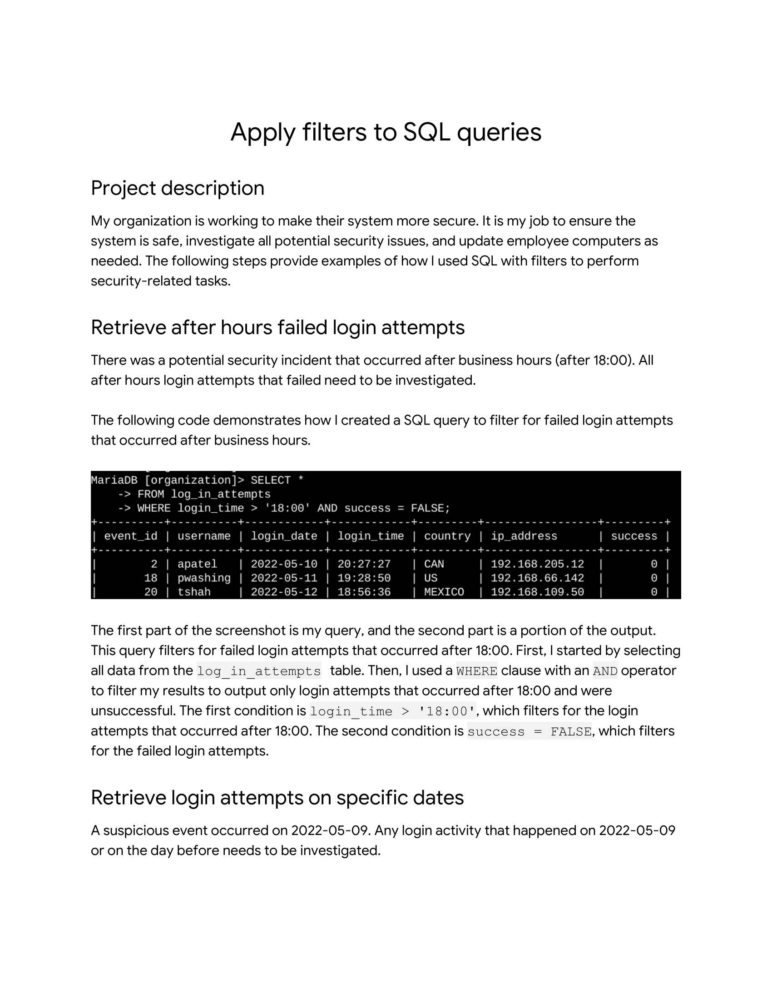
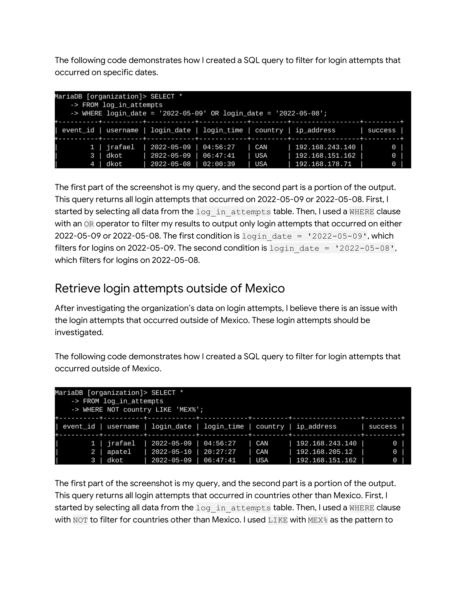
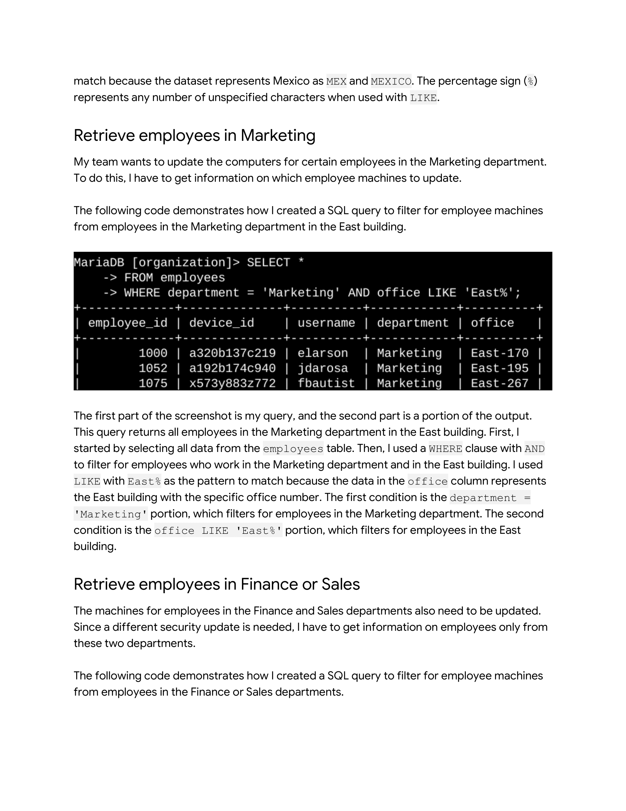
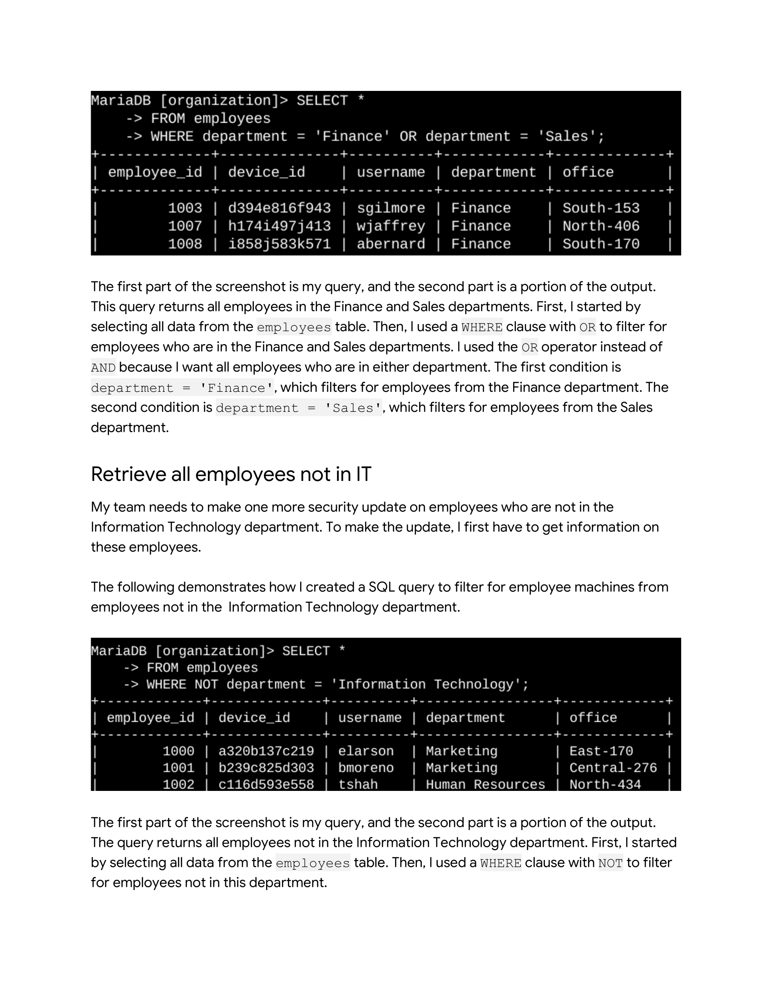

# Apply-filters-to-SQL-queries
I will create a portfolio document showcasing my SQL skills by demonstrating database queries, schema design, and data manipulation techniques
## Scenario

## 

Review the scenario below. Then complete the step-by-step instructions.

You are a security professional at a large organization. Part of your job is to investigate security issues to help keep the system secure. You recently discovered some potential security issues that involve login attempts and employee machines.

Your task is to examine the organization’s data in their employees and log\_in\_attempts tables. You’ll need to use SQL filters to retrieve records from different datasets and investigate the potential security issues.

_Note:_ _This scenario involves the same queries as the ones the_ _Filter with AND, OR, and NOT_ _lab. You can revisit the lab to get screenshots to include in your portfolio document. If you choose, it's also possible to complete this activity without revisiting the lab by typing your queries in the template_

